# Social Network API

## Description
- This helps create a backend for a Social Networking App
- This was built so users cna share their thoughts and reactions as well as build a friend group.
## Table of Contents
- [Installation](#installation)
- [Usage](#usage)
- [Credits](#credits)
- [License](#license)
- [Contribute](#how-to-contribute)
- [Questions](#questions)
- [Instruction Video](#instruction-video)
- [Repo](#repo-link)
## Installation
Clone my repo, use npm i to install needed packages then run npm start.
## Usage
After cloning the repo you'll need to use VS code and Insomnia
### Screenshot on getting all users
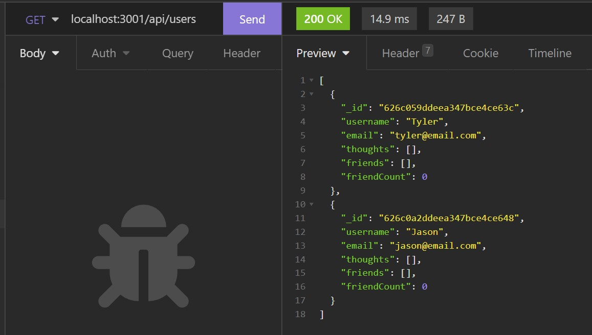
### Screenshot on getting all Thougts
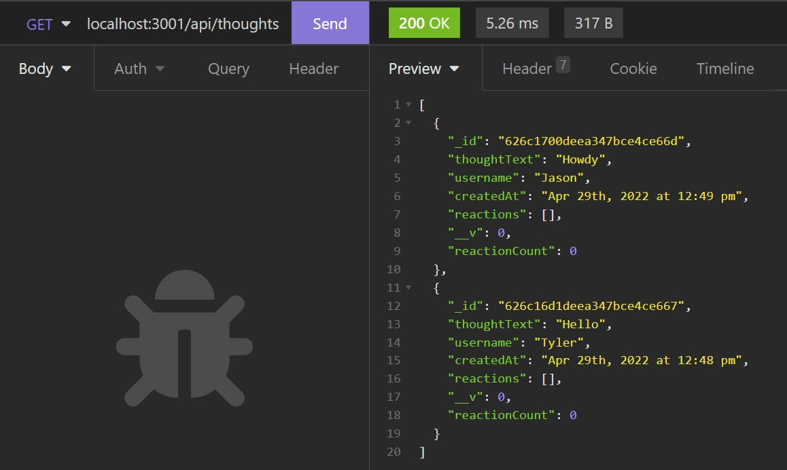
### Screenshot on getting user by ID 
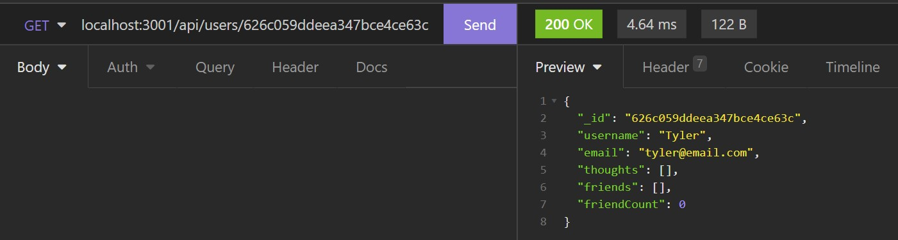
### Screenshot on getting thoughts by ID
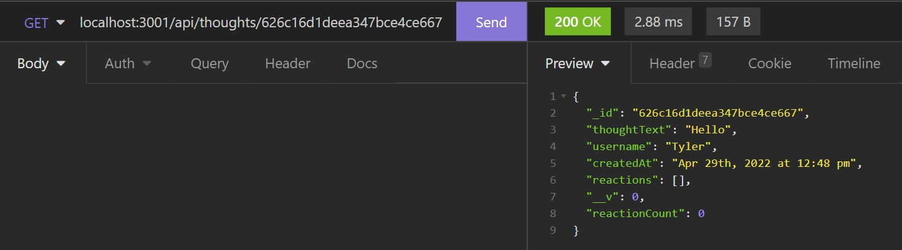
### Screenshot on how to creat a user
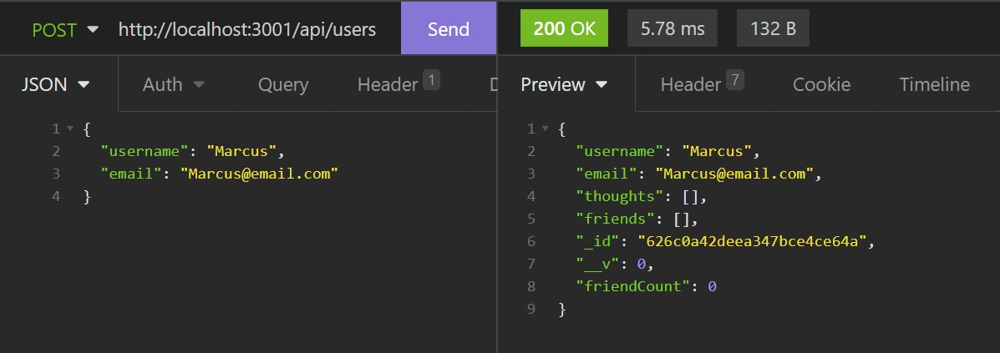
### Screenshot on how to creat a thought
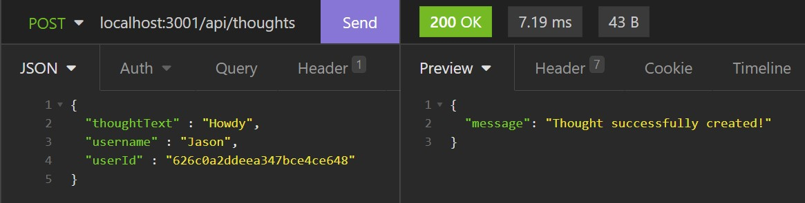
### Screenshot on how to add a friend
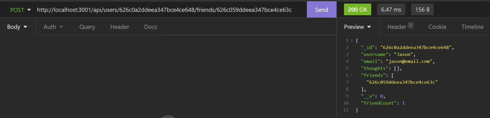
### Screenshot on how to add a reaction
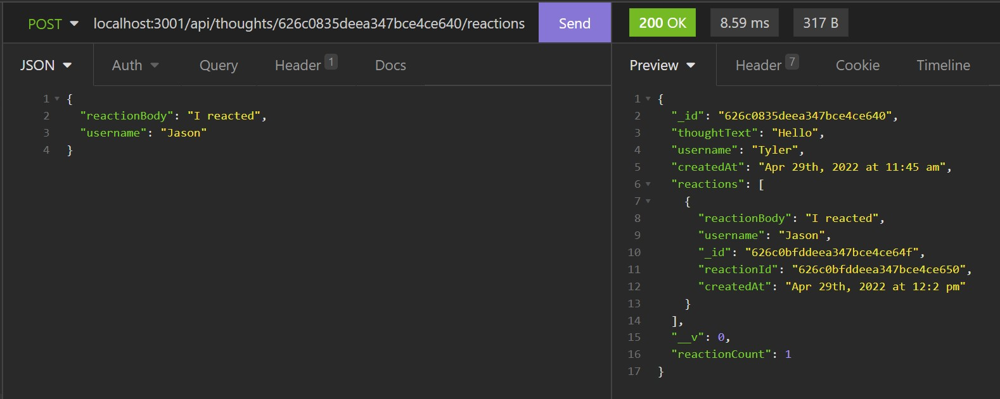
### Screenshot on how to update a user
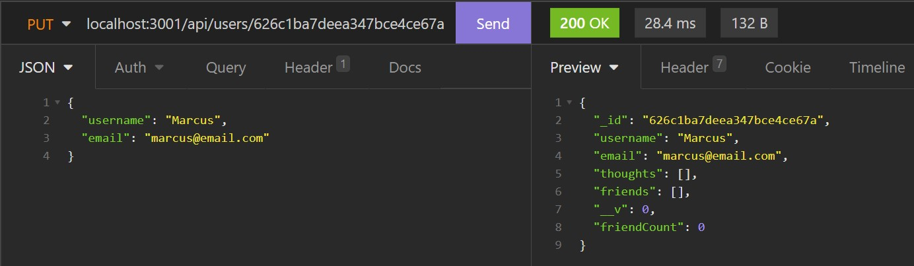
### Screenshot on how to update a thought
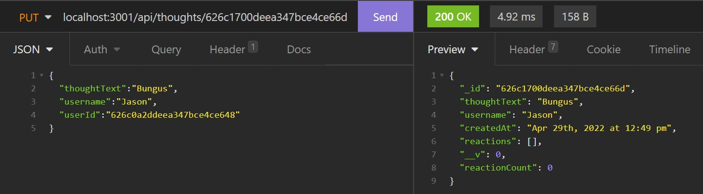
### Screenshot on how to delete a reaction
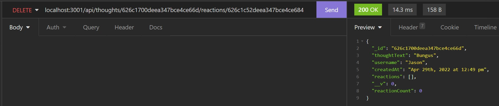
### Screenshot on how to delete a friend
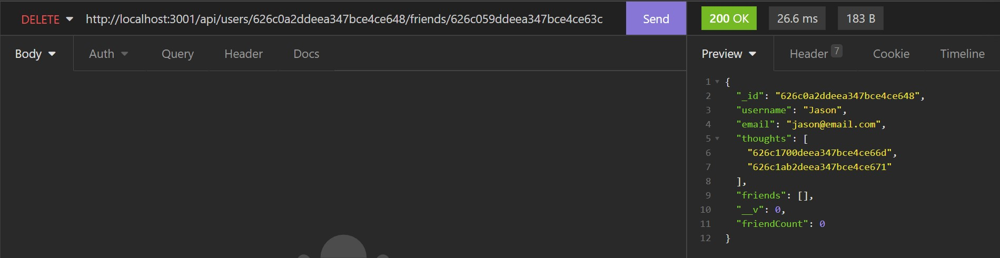
### Screenshot on how to delete a thought
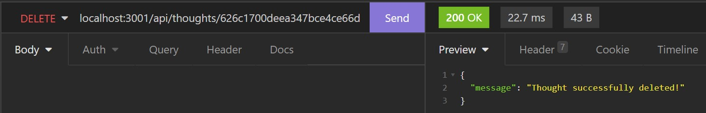
### Screenshot on how to delete a user
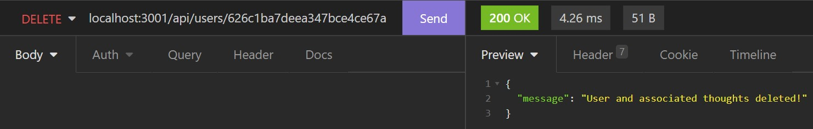
## Credits
TWelk
## License
MIT
## How to Contribute
If you wish to contribute, please contact TWelk
## Questions
* [gitHubLink](https://github.com/TWelk)
* [Contact Me](mailto:twelker08@gmail.com)
## Instruction Video
* [Instruction Video](https://www.youtube.com/watch?v=oOtRoYHugX0)
## Repo Link
* [Repo](https://github.com/TWelk/SocialNetworkAPI)